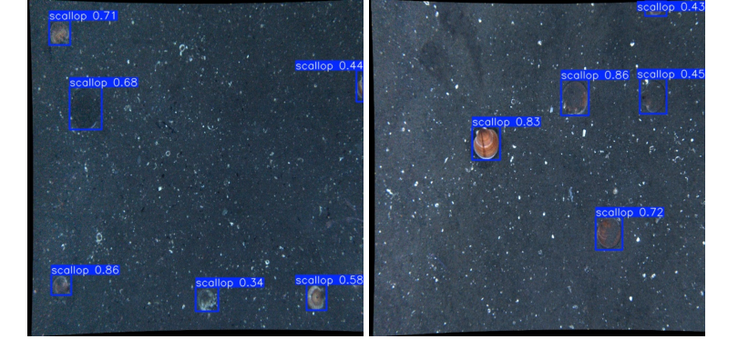
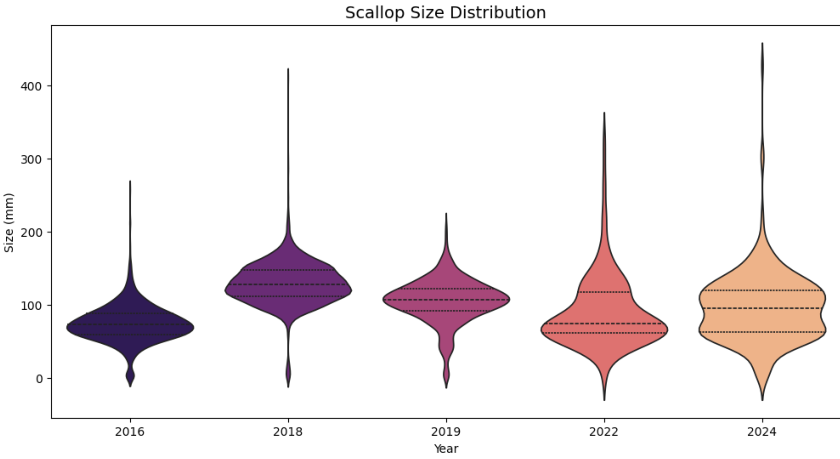
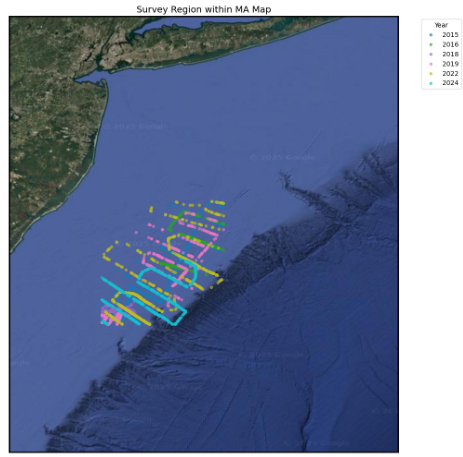
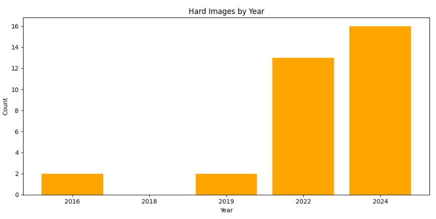
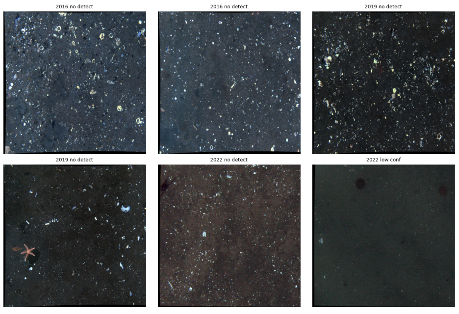

# Scallop Population Analysis with Computer Vision

**Best Project Runner-Up — $1,000 Award**

An end-to-end computer vision pipeline for **detecting, counting, segmenting, and estimating the physical size of sea scallops** from multi-year Mid-Atlantic underwater survey imagery.

The project combines **YOLOv11 Nano** object detection with **MobileSAM** segmentation to convert raw survey images into population, morphology, temporal, and spatial measurements.

> Developed as part of the OceanicAI computer vision project at the College of William & Mary.

## Project Overview

Analyzing thousands of underwater survey images manually is difficult to scale. This project explores how computer vision can automate that workflow while preserving useful ecological measurements.

The pipeline was designed to:

- validate and preprocess multi-year underwater imagery;
- fine-tune YOLOv11 Nano for single-class scallop detection;
- run inference across survey years and estimate scallop abundance;
- use YOLO bounding boxes as prompts for MobileSAM segmentation;
- convert segmented scallop dimensions from pixels to millimeters using camera field-of-view metadata;
- analyze population density, size distributions, geographic coverage, outliers, and difficult detection conditions.

## Example Detection



The detector performs especially well when scallops are clearly visible and separated from surrounding sea-floor objects. The project also examined visually similar species, no-scallop scenes, low-visibility images, and cluttered environments.

## Tech Stack

**Computer Vision & ML:** YOLOv11 Nano, MobileSAM, Ultralytics, PyTorch, OpenCV  
**Data & Analysis:** Python, NumPy, Pandas, Matplotlib, Seaborn  
**Environment:** Google Colab, NVIDIA T4 GPU, Google Drive

## Pipeline

```text
Underwater Survey Images
          │
          ▼
Dataset Validation & Preprocessing
          │
          ▼
YOLOv11 Nano Fine-Tuning
          │
          ▼
Scallop Detection & Counting
          │
          ├──────────────► Population / Temporal Analysis
          │
          ▼
MobileSAM Segmentation
          │
          ▼
Contour Extraction
          │
          ▼
Pixel-to-Millimeter Conversion
          │
          ▼
Size & Spatial Analysis
```

## Dataset Preprocessing

Before training, the dataset was validated and standardized to reduce inconsistencies.

The preprocessing workflow:

- verified that images and YOLO annotation files matched;
- checked that bounding-box coordinates were normalized between 0 and 1;
- cropped stitched survey photographs to a single frame where necessary;
- resized images to **640 × 640**;
- removed non-scallop classes;
- remapped scallops to class `0`;
- prepared a single-class dataset for YOLO training.

The 2015 imagery was used for training. Population inference was then performed on **2016, 2018, 2019, 2022, and 2024** imagery to avoid evaluating population trends on the training year.

## Model Training

The detector was initialized from COCO-pretrained `yolo11n.pt` weights and fine-tuned for scallop detection.

| Parameter | Value |
|---|---|
| Base model | YOLOv11 Nano |
| Epochs | 50 |
| Image size | 640 × 640 |
| Batch size | 16 |
| Classes | 1 — scallop |
| Inference confidence threshold | 0.30 |
| Hardware | NVIDIA T4 GPU |

The Nano model was selected to balance inference throughput with the constraints of Google Colab sessions.

## Detection Results

The trained model processed **600 images per inference year**.

| Year | Images | Scallops Detected | Avg. Scallops / Image |
|---:|---:|---:|---:|
| 2016 | 600 | 1,475 | 2.46 |
| 2018 | 600 | 2,722 | 4.54 |
| 2019 | 600 | 1,142 | 1.90 |
| 2022 | 600 | 358 | 0.60 |
| 2024 | 600 | 391 | 0.65 |

The inference results show substantial variation in detected scallop abundance across survey years. Because ecological conclusions can also be affected by image quality, camera settings, and survey conditions, these values should be interpreted as model-derived estimates rather than direct population censuses.

## YOLO + MobileSAM Size Estimation

Object detection alone provides bounding boxes. To estimate scallop morphology more precisely, each YOLO bounding box was used as a prompt for **MobileSAM**.

```text
YOLO Bounding Box
       │
       ▼
MobileSAM Mask
       │
       ▼
OpenCV Contour
       │
       ▼
Minimum Enclosing Circle
       │
       ▼
Estimated Diameter in Pixels
       │
       ▼
Physical Size in Millimeters
```

For each segmented scallop:

```text
mm_per_pixel = (field_of_view × 1000) / image_width
estimated_size_mm = diameter_pixels × mm_per_pixel
```

This produced per-scallop size estimates that could be compared across survey years.

## Size Distribution



Estimated median scallop size was highest around 2018–2019, decreased notably in 2022, and partially recovered by 2024. The report discusses this pattern as being consistent with a possible influx of younger, smaller individuals followed by later growth, while noting that ecological interpretation requires caution.

## Spatial Analysis

Survey metadata contained latitude and longitude coordinates, allowing the project to compare geographic sampling coverage across years.



The survey tracks overlapped within the same general Mid-Atlantic sub-region, helping distinguish temporal changes in model-derived counts from major shifts in survey location.

## Detection Difficulty Analysis

The project also investigated conditions where the detector struggled. An image was classified as difficult when it contained either:

- zero detections, or
- an average confidence score below **0.45**.

Potential causes included low visibility, darker scenes, buried scallops, dense clusters, shell/debris clutter, and poor image quality.



Examples of missed or low-confidence cases:



This analysis highlights an important limitation: model performance can change with environmental and imaging conditions, so changes in detected abundance should not automatically be interpreted as biological change.

## Key Technical Challenges

### Colab session persistence

Google Colab resets its local filesystem between sessions. To avoid repeatedly rebuilding the dataset, the preprocessing workflow maintained a backup in Google Drive and restored it when a new session started.

### Generalization across years

Training exclusively on 2015 imagery creates a risk of distribution shift when later survey years differ in lighting, visibility, camera settings, or environmental conditions.

### Similar marine objects

Scallops can visually resemble sand dollars, shell fragments, and other objects. The project therefore examined detections in scenes containing visually similar species as well as images containing no scallops.

## Running the Notebook

The project was developed in Google Colab.

Install the primary dependencies:

```bash
pip install -U torch torchvision torchaudio
pip install -U ultralytics
pip install opencv-python pandas numpy matplotlib seaborn tqdm
```

The notebook expects the survey dataset, metadata, and trained weights to be accessible through Google Drive. Update the dataset and model paths to match your own environment before running.

Typical execution order:

```text
Validate Dataset
      ↓
Crop / Resize Images
      ↓
Filter Scallop Labels
      ↓
Train YOLOv11 Nano
      ↓
Run Multi-Year Inference
      ↓
Analyze Population Trends
      ↓
Run YOLO + MobileSAM
      ↓
Estimate Scallop Sizes
      ↓
Generate Temporal / Spatial Visualizations
```

## Repository Structure

```text
Scallop-Population-CV-Project/
│
├── part1_oceanicAI.ipynb
├── README.md
│
├── assets/
│   ├── detection_example.png
│   ├── survey_locations.png
│   ├── size_distribution.png
│   ├── hard_images_by_year.png
│   └── hard_examples.png
│
└── results/
    ├── scallop_population_results.csv
    ├── scallop_measurements.csv
    └── scallop_size_trends.csv
```

## What This Project Demonstrates

- Computer vision dataset validation and preprocessing
- Transfer learning with YOLOv11
- Object detection across thousands of underwater images
- YOLO-to-SAM model integration
- Instance segmentation
- Real-world pixel-to-millimeter measurement
- Temporal population analysis
- Spatial/geographic analysis
- Model failure analysis and limitations
- Scientific data visualization

## Limitations & Future Work

Future improvements could include:

- training on images from multiple survey years to reduce distribution shift;
- reporting and comparing precision, recall, mAP, and other held-out evaluation metrics;
- validating automated size estimates against manual measurements;
- quantifying uncertainty in pixel-to-millimeter conversion;
- incorporating environmental metadata into the analysis;
- using stereo cameras or depth sensors to improve physical size estimation;
- building an interactive dashboard for exploring detections and trends.

## Authors

**Rahima Athar · Stephen Doudaklian · Jiwoo Chung**

Computer Vision Final Project — OceanicAI / College of William & Mary

**Jiwoo Chung**  
Computer Science — George Mason University  
[GitHub](https://github.com/jach36) · [LinkedIn](https://www.linkedin.com/in/jiwoo-chung36/)
